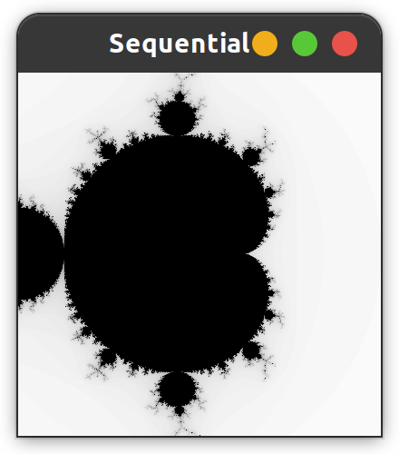
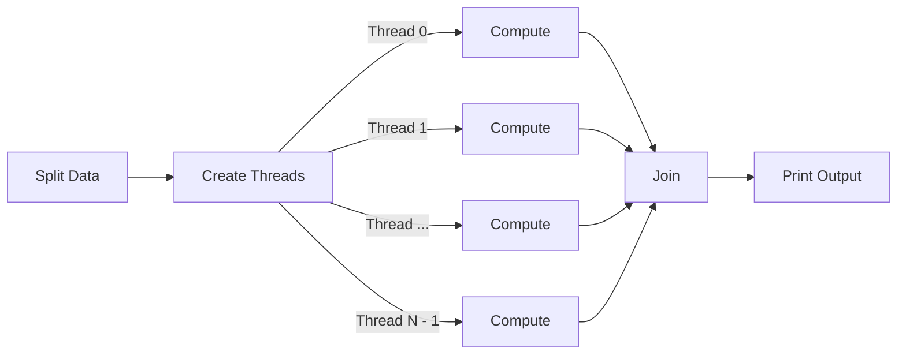
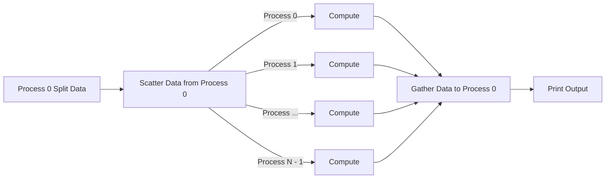

# CSC4005 Project 2 Report

Mao Xi (119020038)

## Abstract

The Mandelbrot set is the set of complex numbers for which the function $f_{c}(z)=z^{2}+c$ does not diverge to infinity when iterated from $z=0$, i.e., for which the sequence $\displaystyle f_{c}(0)$, $f_{c}(f_{c}(0))$, etc., remains bounded in absolute value. This project implemented the approximation of the Mandelbrot set using sequential, Pthreads, and MPI approaches. Their performances were then compared and the results were discussed in this paper.

## Introduction

The Mandelbrot set can be approximated by iterating the following function for finite (`max_iteration`) times: 
$$
Z_{k+1}=Z_k^2+c,\ Z_{0}=0
$$
Where $Z_{k+1}$ is the $(k+1)_{t h}$ iteration of the complex number $Z=a+b i$ and is a complex number giving the position of the point in the complex plan. In a image of height $H$ and width $W, c=\frac{x-\text { height } / 2}{\text { height } / 4}+\frac{y-\text { width } / 2}{\text { width } / 4} \times i$.

Recognizing that:
$$
Z^2=a^2+2 a b i+b i^2=a^2-b^2+2 a b i
$$
where $a$ and $b$ are values of the real and imaginary part, respectively, the computation of $Z_{k+1}$ becomes:
$$
Z_{k+1\ real}=Z_{k\ real}^2-Z_{k\ imag}^2+c_{real}
$$

$$
Z_{k+1\ imag}=2\ Z_{k\ real}Z_{k\ imag}+c_{imag}
$$

which are floating point calculations that can be done by the computer.

To draw the set, for each pixel, repeat doing iterations until $Z_{k}$ diverges or `max_iteration` is reached. Then, record the number of iterations $k$ and use $k/\text{max\_iteration}$ as the pixel's greyscale. Finally, draw the graphic using the greyscales calculated before for each pixel. The following graph is a sample output:



## Method and Design

### 1. $Z_k$ Iterations and Sequential Program

The implementation of $Z_k$ iteration is straightforward. The code to do one-step iteration is:

```c++
void compute(Point* p) {
    Compl z, c;
    float lengthsq, temp;

    /* scale [0, X_RESN] x [0, Y_RESN] to [-1, 1] x [-1, 1] */
    c.real = ((float) p->x - X_RESN / 2) / (X_RESN / 2);
    c.imag = ((float) p->y - Y_RESN / 2) / (Y_RESN / 2);

    z.real = z.imag = 0.0;
    int k = 0;

    do {
        temp = z.real * z.real - z.imag * z.imag + c.real;
        z.imag = 2.0f * z.real * z.imag + c.imag;
        z.real = temp;
        lengthsq = z.real * z.real + z.imag * z.imag;
        k++;
    } while (lengthsq < 4.0 && k < max_iteration);

    p->color = (float) k / max_iteration;
}
```

The following graphs display the impact of graphic height and width. From left to right, the resolution are 400x400, 800x800, 1600x1600, respectively. It is obvious that a higher resolution leads to better image quality and much more details.

<center class="half">
    
</center>


`max_iteration` also influences the graph output. Pictures below are two 800x800 outputs with `max_iteration`= 100 and 1000, respectively. It can be clearly seen from the pictures that a higher `max_iteration` leads to smoother edges and clearer details.

<center class="half">
    
</center>

The sequential program is trivial: Create an array of pixels (represented by `struct Point`, loop through all pixels, and do $Z_{k}$ iterations

```c++
typedef struct pointtype {
    int x, y;
    float color;
} Point;
```

```c++
total_size = X_RESN * Y_RESN;
data = new Point[total_size];
int i, j;
Point* p = data;
for (i = 0; i < X_RESN; i++) {
    for (j = 0; j < Y_RESN; j++) {
        p->x = i;
        p->y = j;
        p++;
    }
}
```

```c++
Point *p = data;
for (int index = 0; index < total_size; index++) {
    compute(p);
    p++;
}
```

### 2. Pthreads Program

N (specified by command line arguments) threads are created to calculate the Mandelbrot set in parallel. The general process can be divide into three parts: data splitting, computation, and data collection.

#### Data Splitting

The point array is evenly split to every threads. To determine the size of the sub-array of each threads, I divide the array size by the number of threads and scatter the remainder K pixels evenly to the first K threads.

```c++
const int quotient = total_size / n_thd;
const int remainder = total_size % n_thd;
std::vector<int> send_counts(n_thd);
std::vector<int> displs(n_thd + 1);

for (int i = 0; i < n_thd; i++) {
    send_counts[i] = quotient;
    if (i < remainder) send_counts[i]++;
}
displs[0] = 0;
for (int i = 1; i <= n_thd; i++) {
    displs[i] = displs[i - 1] + send_counts[i - 1];
}
```

#### Computation

After data splitting, N threads are created via `pthread_create`. Each thread is assigned a sub-array and do exactly the same thing as the sequential program.

```c++
// create threads
for (int thd = 0; thd < n_thd; thd++) {
    args[thd].begin = data + displs[thd];
    args[thd].end = data + displs[thd + 1];
}
for (int thd = 0; thd < n_thd; thd++)
    pthread_create(&thds[thd], nullptr, worker, &args[thd]);
```

```c++
void *worker(void *args) {
    Args *arg = static_cast<Args *>(args);
    compute_block(arg->begin, arg->end);
}
```

#### Data Collection

Firstly, wait for all threads to finish execution:

```c++
for (int thd = 0; thd < n_thd; thd++)
    pthread_join(thds[thd], nullptr);
```

Data collection is trivial for shared memory model like Pthreads. Since threads modify the pixel array in place, there is no need to explicitly collect computation results.



### 3. MPI Program

N (specified by command line arguments) processes are created to do calculations. The general process can be divide into three parts: data distribution, computation, and data collection.

#### Data Distribution

The main process (process with rank = 0) will initialize the point array and do data distribution. The data splitting process is the same as that in the Pthreads program. However, to distribute `struct Point` to worker processes (processes with rank >= 1), I create a new MPI data type `MPI_POINT`:

```c++
MPI_Datatype MPI_POINT;
int blocklengths[] = {1, 1, 1};
MPI_Aint displacements[] = {offsetof(Point, x), offsetof(Point, y), offsetof(Point, color)};
MPI_Datatype types[] = {MPI_INT, MPI_INT, MPI_FLOAT};
MPI_Type_create_struct(3, blocklengths, displacements, types, &MPI_POINT);
MPI_Type_commit(&MPI_POINT);
```

Then, I use `MPI_Scatterv` to scatter sub-arrays to **all processes**:

```c++
MPI_Scatterv(
    data, send_counts.data(), displs.data(), MPI_POINT,
    sub_arr, send_counts[rank], MPI_POINT, 0, MPI_COMM_WORLD
);
```

#### Computation

The computation is also trivial for the MPI program: Each process calculate its sub-array of points

```c++
void compute_block(Point* begin, Point* end) {
    for (Point* cur = begin; cur != end; cur++)
        compute(cur);
}
compute_block(sub_arr, sub_arr + send_counts[rank]);
```

#### Data Collection

After all processes finish computation, they gather results to the main process via `MPI_Gatherv`:

```c++
MPI_Gatherv(
    sub_arr, send_counts[rank], MPI_POINT,
    data, send_counts.data(), displs.data(), MPI_POINT, 0, MPI_COMM_WORLD
);
```




### 4. GUI Rendering

If a GUI output is required, after the computation part is done, the main thread (or main process for MPI) will plot the graph with `OpenGL` and `GLUT` using code provided in the template:

```c++
void plot() {
    glClear(GL_COLOR_BUFFER_BIT);
    glColor3f(0.0f, 0.0f, 0.0f);

    GLfloat pointSize = 1.0f;
    glPointSize(pointSize);
    glBegin(GL_POINTS);
    glClear(GL_COLOR_BUFFER_BIT);

    int count;
    Point* p = data;
    for (count = 0; count < total_size; count++) {
        glColor3f(1.0f - p->color, 1.0f - p->color, 1.0f - p->color);
        glVertex2f(p->x, p->y);
        p++;
    }

    glEnd();
    glFlush();
}
```

### 5. Compile and Run

#### Compile the Project

The project uses the provided code template with CMake as the build tool. It can be compiled with instructions below.

Without GUI:

```shell
cd <project root path>
mkdir build-release-nogui
cmake -DCMAKE_BUILD_TYPE=Release -G "Unix Makefiles" -S . -B ./build-release-nogui
cmake --build ./build-release-nogui
```

With GUI:

```shell
cd <project root path>
mkdir build-release-gui
cmake -DCMAKE_BUILD_TYPE=Release -DGUI=ON -G "Unix Makefiles" -S . -B ./build-release-gui
cmake --build ./build-release-gui
```

#### Run the Executables

The compilation process will generate three executables: `sequential`, `pthread`, `mpi`

Assume you already `cd` into the build directory. The ways to run them are the same as those in code template:

- Sequential: 

  ```shell
  ./sequential $X_RESN $Y_RESN $max_iteration
  ```

- Pthreads

  ```shell
  ./pthread $X_RESN $Y_RESN $max_iteration $n_thd
  ```

- MPI

  ```shell
  mpirun -np $n_proc ./mpi $X_RESN $Y_RESN $max_iteration
  ```

Parameters' default values are:

- `X_RESN` and `Y_RESN`: 800
- `max_iteration`: 100
- `n_thd`: 4
- `n_proc`: 1

#### Sample Outputs

The GUI output is displayed in Introduction section.

No GUI outputs:

<center class="half">
    
</center>

### 6. Experiments Design

In experiments, all graphs were square (i.e. height = width). Term `data size` would be used to reference height or width. I selected the following data size to do experiments:

- 100, 200, 400, 800, 1600, 3200

Moreover, for Pthreads and MPI programs, the following threads/processes were used to test the effect of parallelism:

- 1, 2, 4, 8, 16

Experiments were done without GUI (i.e. computation only) in the HPC. Each case will be run for **5 times** to get the average running time and speed.

I wrote python scripts `run_tests_<type>.py` to enumerate all combinations of data size and thread/process number, generate a `sbatch` script for each configuration, and submit the tasks to the HPC. I also wrote a python script `parse_outputs.py` to collect the running time of each task and put the statistics into a csv file.

## Result and Discussion


### 1. Sequential

Figures below displayed the running time and speed of the sequential program:

| data size | time (s) | speed (pixels/s) |
| --------- | -------- | ---------------- |
| 100       | 0.003859 | 2591344.908      |
| 200       | 0.008212 | 4870801.978      |
| 400       | 0.033746 | 4741274.573      |
| 800       | 0.121236 | 5278960.045      |
| 1600      | 0.479964 | 5333728.918      |
| 3200      | 1.907366 | 5368660.799      |


Assume the workloads to do $Z_k$ iteration for different pixels didn't vary much, the time complexity regarding data size n should be $O(n^2)$, since doubling n quadruples the total number of pixels. Below is the running time curve using a logarithm scale, from which we could find that experiment data fit the theoretical complexity well -- doubling data size results in constant increase in $Log_{running\ time}$.


Another fact to notice is that, the running speed increased as data size increased from 100 to 400 and then remained stable around 5.3 million pixels / second. This was due to the start-up overhead -- when data size is small, the time to allocate memory and initialize the point array occupied quite a portion of total running time, which harmed the running speed. As data size grew larger, this portion of time became negligible so that the running time went stable, reflecting the actual computational speed.

### 2. Pthreads

Figures below demonstrated the running time and speed of different test cases.


Compare the performance of the 1-thread Pthreads program with the sequential one above, we found that the Pthreads version slightly outperformed the latter one. This was due to the additional overhead induced by creating threads.  

For a fixed number of threads, the growth trend of running time still roughly fit the time complexity discussed before. Also, it was true for all cases except the 16-threads one that the running speed grew at first and remained relatively stable as data size increased, for which the previous explanation for the sequential program still held. For the 16-threads case, I believed it would also reached to a stable point for some larger data size.

Another discovery is about speed up factor. The following figures displayed the speed up factors of each configuration:


We could easily found that the speed up factor grew far more slower than the growth of thread number, which was partially due to:

1. Thread dispatch overhead
2. Unevenly distributed workloads. Since the workloads to do $Z_k$ iteration for different pixels might differ a lot for some sub-arrays, the program might need to wait for a few threads running much slower than others.

Besides, there were many fluctuations in the curves. Generally, the speed up factor first went down, reached the minimum value at data size = 200, then grew up. This was a weird behavior that cannot be easily explained. Possible explanations included the effect of device-specific-architecture and unstable computational resources available in the HPC.

### 3. MPI

Figures below were the results of running the MPI program:


Same as the situation of Pthreads, 1-process MPI program also outperformed the sequential one for the same reason. 

For a fixed number of threads, the growth trend of running time also fit the time complexity. Besides, for all MPI configurations, the running speed grew at first and remained relatively stable as data size increased. Moreover, stable running speed curves suggested MPI achieved higher speed-ups than Pthreads, which could be better viewed in the speed up chart presented below: 


The speed up factor curves of the MPI program had much less fluctuations than that of the Pthreads program. Moreover,   the MPI program generally had higher speed up factors than the Pthreads one. The growth rate of speed up factor was still much lower than the increasing in process number, for similar reasons as Pthreads as well as massage passing overhead.

Generally speaking, the chart of the MPI program looked much more "standard" than that of Pthreads.

### 4. Pthreads v.s. MPI

<center class="half">
    
</center>

Judging from the figures, MPI beat threads in running speed, especially for smaller data (e.g. data size = 100) and larger data (data size >= 400) with high parallelism (number of threads / processes >= 8), which was unexpected because I thought message passing models would generally had higher overhead than shared-memory models.  The explanation for small data was that the MPI program did initialization（`MPI_Init` and  create `MPI_POINT`） before the timer started while the Pthreads program created threads (`pthread_create`) after the timer started. The difference in initialization time led to the Pthreads program's inferiority for small data. For big data and high parallelism, I attributed Pthreads' pooler performance to internal thread dispatch mechanisms. For example, one thread might be improperly dispatched so that it finished much later than other ones, hurting overall performance. However, this hypothesis need further investigations.

## Conclusion

In this project, I implemented sequential, Pthreads, and MPI versions of calculating the Mandelbrot set in C++ and done experiments to investigate their performance under several problem / hardware configurations. The results indicated that parallel programs significantly overperformed the sequential one for computational intensive tasks like calculating the Mandelbrot set. However, the speed up factor grew much slower than the increasing in thread / process number, which might be partially due to unevenly distributed workloads and could be alleviated by dynamically allocating jobs. Moreover, the results gave us some indication in choosing parallel models. For parallel tasks that required no / few inter-process (or thread) communications, MPI seemed to be a better choice than Pthreads regarding running speed.

