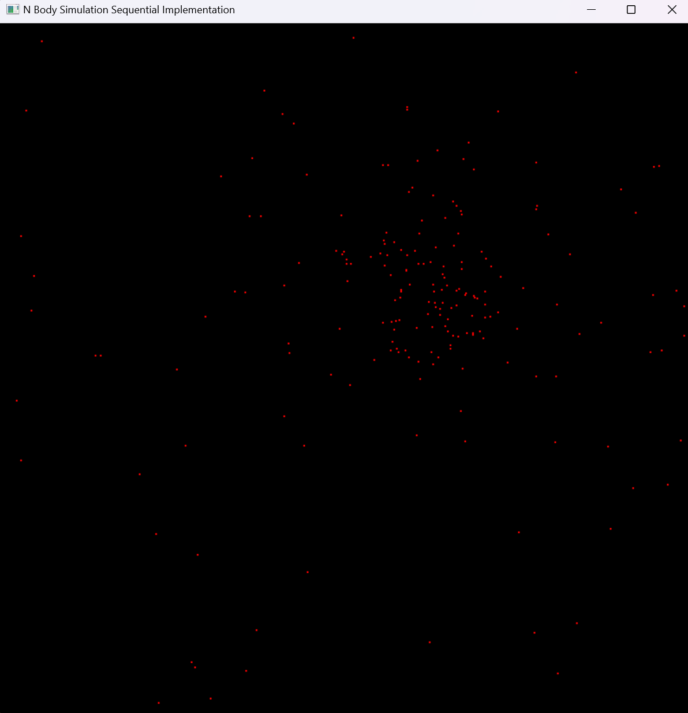
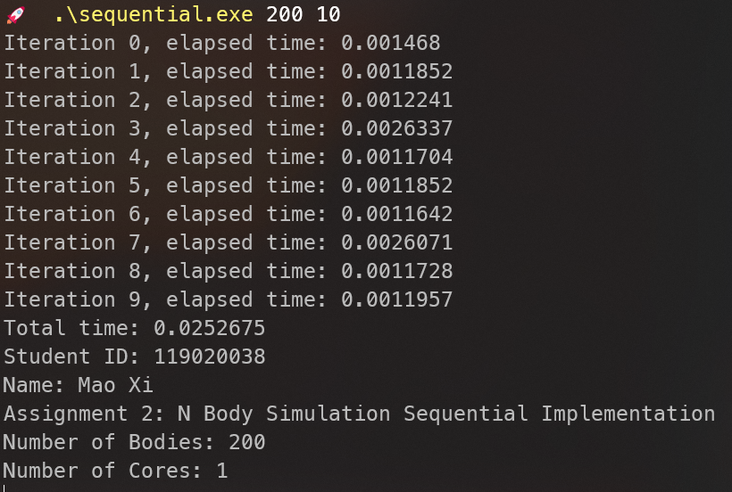
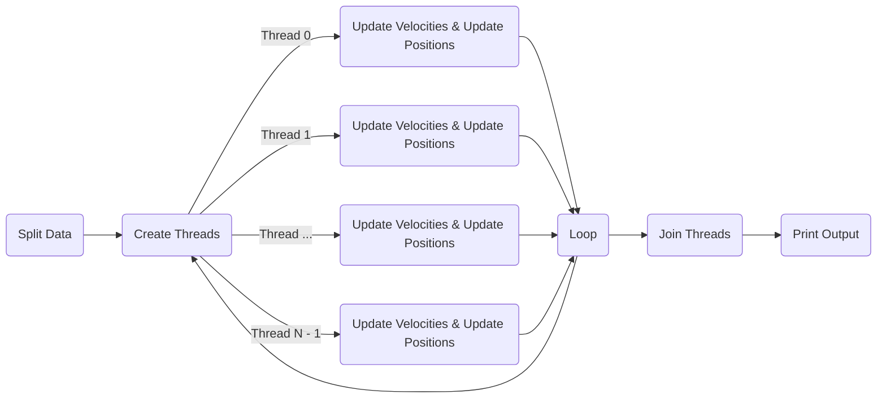
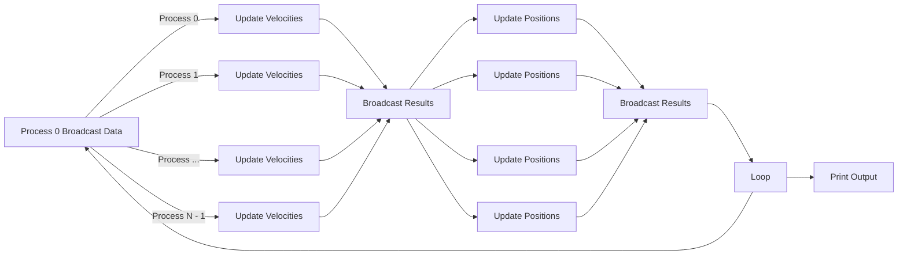
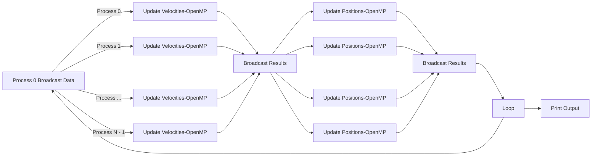

# CSC4005 Project 2 Report

Mao Xi (119020038)

## Abstract

N-body simulation is a simulation of a dynamical system of particles. It is usually under the influence of physical forces like gravity, widely used in astrophysics and physical cosmology (From Wikipedia).

This project simulated N bodies' movements under gravity forces using sequential, Pthreads, OpenMP, MPI, CUDA, and MPI-OpenMP approaches. Their performances were then compared and the results were discussed in this paper.

## Introduction

The initial positions and masses of N bodies are randomly generated. Their continuous movements are simulated using several discrete iterations with tiny time intervals `dt`. In each iteration, the simulation consists of the following steps:

1. Calculate the gravity between any two bodies using the gravity force equation: $F = \frac{G m_1 m_2}{r^2}$. For each body, sum up all gravity forces applied on it and calculate the acceleration, and then update its velocity: $$V_{new}\ =\ V+a\times dt$$
2. Using the speed values calculated in step 1, update bodies' positions: $X_{new}\ =\ X+V_{new}\times dt$, and handle any wall collision/body collision.

The time complexity for one iteration is roughly $O(N^2)$, because we are updating N bodies, each requires looping through N - 1 other bodies to sum up the total gravity force and determine collisions.

The following are sample GUI and console outputs:





## Method and Design

### 0. Physics

#### Data Structures

I define `struct Vector` to represent 2-D vectors in physics, whose operator overloadings follow physics rules:

```c++
struct Vector {
    double x;
    double y;

    // many operator overloadings...
};
```

Then, I define `struct Point` and `struct Velocity` inheriting `Vector` to represent position and velocity, respectively.

```c++
struct Point : Vector {
    double sqr_dist(const Vector& rhs) const {
        const Vector diff = *this - rhs;
        return diff.x * diff.x + diff.y * diff.y;
    }
};

struct Velocity : Vector {
    Velocity() = default;
    Velocity(const double vx, const double vy) : Vector{vx, vy} {}
};
```

Three global variables are used to represent bodies' data:

-  `m`: `std::vector<double>`, the mass array
- `pos`: `std::vector<Point>`, stores x and y coordinates
- `v`: `std::vector<Velocity>`, stores velocities

#### Handle Wall Collision

When a body's x or y coordinate goes out of bound, a wall collision happens. Wall collisions follow the rule of perfectly elastic collision -- The body bounce with the same speed and symmetric angle.

```c++
void handle_wall_collision(Point& pos, Velocity& v) {
    if (pos.x < 0) {
        pos.x = 0;
        v.x = -v.x;
    }
    else if (pos.x > BOUND_X) {
        pos.x = BOUND_X;
        v.x = -v.x;
    }
    if (pos.y < 0) {
        pos.y = 0;
        v.y = -v.y;
    }
    else if (pos.y > BOUND_Y) {
        pos.y = BOUND_Y;
        v.y = -v.y;
    }
}
```

#### Handle Collision with Other Bodies

When two bodies' distance is less than two times a body's radius, a body collision happens. To reduce computation workloads, body collisions are handled by simply inverting both bodies' speed direction and move them a bit far away from each other.

```c++
// perform bounce if two bodies are too close
if (pos[i].sqr_dist(pos[j]) < COLLISION_DIST2) {
    do_bounce(m[i], m[j], pos[i], pos[j], v[i], v[j]);
}

void do_bounce(const double m1, const double m2, Point& pos1, Point& pos2, Velocity& v1,
               Velocity& v2) {
    // simple workaround: invert the speed
    v1.x = -v1.x;
    v1.y = -v1.y;
    v2.x = -v2.x;
    v2.y = -v2.y;

    // move the bodies away from each other
    pos1 += v1 * DT;
    pos2 += v2 * DT;
}
```

### 1. Sequential Program

With above code, the sequential program becomes straightforward -- update velocity and position for each body one by one.

```c++
void update_velocities(const std::vector<double>& m, const std::vector<Point>& pos,
                       std::vector<Velocity>& v, const size_t n) {
    for (size_t i = 0; i < n; i++) {
        update_velocity(m, pos, v, n, i);
    }
}

void update_positions(const std::vector<double>& m, std::vector<Point>& pos,
                      std::vector<Velocity>& v, const size_t n) {
    for (size_t i = 0; i < n; i++) {
        update_position(m, pos, v, n, i);
    }
}
```

### 2. General Parallel Design

N bodies are evenly split into m subsets, where m is the number of workers (processes or threads). Each worker will be in charge of updating a subset of bodies' velocities and positions. Additionally, a displacement array `displs` is created to record the begin and end index of each worker's subset, facilitating work distribution in each iteration.

```c++
// linearly and evenly split the data
void split_data(int* counts, int* displs, const int total_count,
                const int num_partitions) {
    const int quotient = total_count / num_partitions;
    const int remainder = total_count % num_partitions;
    for (size_t i = 0; i < num_partitions; i++) {
        counts[i] = quotient;
        if (i < remainder) counts[i]++;
    }
    displs[0] = 0;
    for (size_t i = 1; i <= num_partitions; i++) {
        displs[i] = displs[i - 1] + counts[i - 1];
    }
}
```

### 3. Pthreads Program

M (specified by command line arguments) threads are created to do simulation. Since `Pthreads` is a shared memory parallel model, all I need to do is to create N threads and split computation tasks to them.

```c++
std::vector<pthread_t> threads(n_thd);
for (int i = 0; i < n_thd; ++i) {
    pthread_create(&threads[i], nullptr, worker, &args[i]);
}
```

Each worker thread will simulate its subset of bodies for n iterations (specified by arguments, too). Moreover, when a thread finishes one iteration, it reaches a barrier and cannot proceed until all threads finish an iteration. The synchronization mechanism prevents incorrect simulation, for example, a thread starts to update positions while other threads are still updating velocities (which results in errors in collisions), from happening.

```c++
void* worker(void* args) {
    const auto [begin, end, n_iterations] = *static_cast<Args*>(args);
    // waiting for a start signal
    for (int i = 0; i < n_iterations; ++i) {
        update_velocities(m, pos, v, n_body, begin, end);
        pthread_barrier_wait(&inner_barrier);
        update_positions(m, pos, v, n_body, begin, end);
        pthread_barrier_wait(&barrier);
    }
    pthread_exit(nullptr);
    return nullptr;
}
```

To avoid data race, a `pthread_mutex` is used to protect function `do_bounce` , which is the only place where simultaneous reading and writing by different threads may happen.

```c++
pthread_mutex_lock(&data_mutex);
do_bounce(m[i], m[j], pos[i], pos[j], v[i], v[j]);
pthread_mutex_unlock(&data_mutex);
```

In the end, main thread waits for worker threads to finish execution by calling `pthread_join`.



### 4. OpenMP Program

The OpenMP version is quite simple: Adding a `#pragma omp parallel for` directive will do the trick.

```c++
void update_velocity(const std::vector<double>& m, const std::vector<Point>& pos,
                     std::vector<Velocity>& v, const size_t n) {
    #pragma omp parallel for
    for (int i = 0; i < n; ++i) {
        update_velocity(m, pos, v, n, i);
    }
}

void update_position(const std::vector<double>& m, std::vector<Point>& pos,
                     std::vector<Velocity>& v, const size_t n) {
    #pragma omp parallel for
    for (int i = 0; i < n; ++i) {
        // update single body's position
    }
}
```

One thing worth mentioning is that, to avoid data race, function `do_bounce` needs to reside in an OpenMP critical section for the same reason as explained above.

```c++
#pragma omp critical
{ do_bounce(m[i], m[j], pos[i], pos[j], v[i], v[j]); }
```

### 5. MPI Program

M (specified by command line arguments, 1 master and M - 1 slaves) processes are created to do calculations.

#### Data Distribution

Each process holds a full copy of mass, velocity, and position array. The master process (process with rank = 0) will initialize the arrays and broadcast them to all slave processes. For convenience, I create a new MPI data type `MPI_VECTOR`:

```c++
// create a MPI data type for struct Vector
MPI_Datatype MPI_VECTOR;
MPI_Type_contiguous(2, MPI_DOUBLE, &MPI_VECTOR);
MPI_Type_commit(&MPI_VECTOR);

// copy data to slaves
MPI_Bcast(m.data(), n_body, MPI_DOUBLE, 0, MPI_COMM_WORLD);
MPI_Bcast(pos.data(), n_body, MPI_VECTOR, 0, MPI_COMM_WORLD);
MPI_Bcast(v.data(), n_body, MPI_VECTOR, 0, MPI_COMM_WORLD);
```

#### Computation

Master and all slave processes will do the computation. Each process computes its own subset of data and broadcast the result to all processes. Moreover, similar to the Pthreads version, a barrier is placed to ensure simulation correctness.

```c++
const int begin = displs[rank], end = displs[rank + 1];

// update velocities
update_velocities(m, pos, v, n_body, begin, end);
// broadcast updated velocities
for (int i = 0; i < world_size; ++i) {
    MPI_Bcast(&v[displs[i]], counts[i], MPI_VECTOR, i, MPI_COMM_WORLD);
    MPI_Barrier(MPI_COMM_WORLD);
}

// update positions
update_positions(m, pos, v, n_body, begin, end);
// broadcast updated positions and velocities
for (int i = 0; i < world_size; ++i) {
    MPI_Bcast(&pos[displs[i]], counts[i], MPI_VECTOR, i, MPI_COMM_WORLD);
    MPI_Bcast(&v[displs[i]], counts[i], MPI_VECTOR, i, MPI_COMM_WORLD);
    MPI_Barrier(MPI_COMM_WORLD);
}
```

#### Data Collection

Since each process holds a full copy of data, there's no need for data collection.



### 6. MPI + OpenMP

This version modifies the vanilla MPI program by using OpenMP to run function `update_velocities` and `update_positions` in each process.




### 7. CUDA Program

This version is different from previous ones. Since we have plenty of CUDA cores, I will launch as many CUDA threads as number of bodies, each will in charge of updating **one** body's data. 

```c++
__global__ void update_velocities(const double* m, const Point* pos, Velocity* v, const int n) {
    const unsigned int idx = blockDim.x * blockIdx.x + threadIdx.x;
    if (idx < n) {
        // update v[idx]
    }
}

__global__ void update_positions(const double* m, Point* pos, Velocity* v, const int n) {
    const unsigned int idx = blockDim.x * blockIdx.x + threadIdx.x;
    if (idx < n) {
        // update pos[idx] (and v[idx] in case of collision)
    }
}
```

Another difference is, to avoid data race, I modify the body collision logic so that it only changes one body's position and velocity:

```c++
// do bounce
Velocity& v1 = v[idx];
Point& pos1 = pos[idx];
// simple workaround: invert the speed
v1.x = -v1.x;
v1.y = -v1.y;
// move the body away
pos1 += v1 * DT;
```

After each iteration, the position vector is copied from device memory to host memory for GUI display purpose.


## Running and Experiments

### 1. Compile and Run

#### Compile the Project

The project uses the provided code template with CMake as the build tool. You can `cd` to project root directory and run the following shell scripts to build:

- `scripts/cmake_release.sh` for non-GUI version
- `scripts/cmake_release_gui.sh` for GUI version

Alternatively, you can enter commands contained in above scripts by your self:

Without GUI:

```shell
cd <project root path>
mkdir build-release-nogui
cmake -DCMAKE_BUILD_TYPE=Release -G "Unix Makefiles" -S . -B ./build-release-nogui
cmake --build ./build-release-nogui
```

With GUI:

```shell
cd <project root path>
mkdir build-release-gui
cmake -DCMAKE_BUILD_TYPE=Release -DGUI=ON -G "Unix Makefiles" -S . -B ./build-release-gui
cmake --build ./build-release-gui
```

#### Run the Executables

The compilation process will generate six executables: `sequential`, `pthread`, `openmp`, `mpi`, `cuda`, `mpiomp`

Assume you already `cd` into the build directory. The ways to run them are the same as those in code template:

- Sequential: 

  ```shell
  ./sequential $num_bodies $num_iterations
  ```

- Pthreads

  ```shell
  ./pthread $num_bodies $num_iterations $n_thd
  ```

- OpenMP

  ```shell
  ./openmp $num_bodies $num_iterations $num_processes
  ```

- MPI

  ```shell
  mpirun -np $n_proc ./mpi $num_bodies $num_iterations
  ```

- CUDA

  ```shell
  ./cuda $num_bodies $num_iterations
  ```

- MPI-OpenMP

  ```shell
  mpirun -np $n_proc ./mpiomp $num_bodies $num_iterations $omp_processes
  ```


### 2. Experiments Design

In experiments, all graphs were square (800 x 800). Term `data size` would be used to reference the number of bodies. I selected the following data size to do experiments:

- 500 (small), 2500 (medium), 5000 (large)

For the CUDA program, additional massive sized data (data size = 10000, 15000, 17500, 18750, and 20000) were used. 

Moreover, for Pthreads, OpenMP, and MPI programs, the following number of threads/processes were used to test the effect of parallelism:

- 1, 2, 4, 8, 16, 32, 40

For the MPI-OpenMP program, OpenMP always used 4 threads, and MPI used the following number of processes:

- 1, 2, 4, 8, 10

Experiments were done without GUI (i.e. computation only) in the HPC. Each case will be run for **5 times** to get the average running time and speed.

I wrote python scripts `run_tests_<type>.py` to enumerate all combinations of data size and thread/process number, generate a `sbatch` script for each configuration, and submit the tasks to the HPC. I also wrote a python script `parse_outputs.py` to collect the running time of each task and put the statistics into a csv file.

## Result and Discussion

### 1. Sequential

Figures below displayed the running time and speed of the sequential program:


The running time suggested that the experiment data followed $O(N^2)$ time complexity, which fit the theoretical complexity well.

### 2. Pthreads

Figures below demonstrated the running time of different test cases.


The performance of the 1-thread Pthreads program was close to that of the sequential one.

For a fixed number of threads, the growth trend of running time still roughly fit the time complexity discussed before. Starting from two threads, doubling number of threads roughly cut half of running time, which is under expectation. However, going from 1 thread to 2 threads didn't bring much speed up. This was due to the additional overhead induced by mutex lock and synchronization between threads.  

The following figures displayed the speed up factors of each configuration:


Generally, for fixed number of threads, as data size increased, the speed-up factor first increased until reaching a stable point. The larger number of threads we had, the "later" the speed-up factor reached the stable point, which is reasonable as higher level of parallelism required larger data to offset the additional cost. Besides, judging from the data, the (stable) system efficiency of the Pthreads program is about 0.5.

### 3. OpenMP

Figures below displayed the running time of various OpenMP configurations:


Looking at running time figures, we could see little difference compared to Pthreads figures. However, the speed-up factor demonstrated different properties:


Although in nearly all configures, OpenMP outperformed Pthreads in speed-up factor, its speed-up curve manifested much more obvious growth trend (especially for 32 and 40 threads), suggesting the two possibilities:

1. OpenMP version's speed-up factor would continue growing as data size increased and might finally overperform Pthreads version
2. More possibly, judging from the stable speed-up factors of 2, 4, and 8 threads curves, the OpenMP program would finally reach similar speed-up factors to the Pthreads version, indicating that Pthreads is a slightly better choice for this task 

### 4. MPI

Figures below were the results of running the MPI program:


MPI program with 4 processes displayed fluctuations in running time, which might be due to the unstable message passing speed during test time. Other properties of the figures resembled Pthreads and OpenMP. However, MPI achieved lower speed-ups than Pthreads, which could be better viewed in the speed up chart presented below: 


One significant difference was that MPI's speed-up factors were very low for configurations with large process number, which was the result of huge MPI initialization overhead. Moreover, MPI's speed-up factors grew even slower than OpenMP -- the 40 processes version even outperformed the 32 processes version when data size was 2500. Regarding speed-up factors' absolute values, MPI outperformed Pthreads and roughly equaled to OpenMP. Generally speaking, MPI performed worse than former two models. Frequent broadcasting results might be responsible for that.

### 5. MPI-OpenMP

Below were running time charts of the MPI-OpenMP program. MPI's chart was also attached for reference:

<center>
    
</center>

The comparison between MPI and MPI-OpenMP programs indicated that, by using 4-threads OpenMP, the MPI-OpenMP program achieved 2~4x speed-up, which was pretty decent, since pure OpenMP only had 50% system efficiency. Another interesting fact was MPI-OpenMP's chart looked very "standard" -- There were no fluctuations; Running time quadrupled when data size doubled, and went to a half when number of processes doubled.


Regarding speed-up factors and system efficiency, surprisingly, MPI-OpenMP performed better than both MPI and OpenMP, even Pthreads. One possible explanation was that this approach combined the advantages of MPI and OpenMP:

1. Compared to pure MPI, MPI-OpenMP had fewer processes, thus reduced message passing overheads
2. Compared to pure OpenMP, MPI-OpenMP had less threads waiting for entering the critical section, increasing multi-threading efficiency
3. Compared to Pthreads, MPI-OpenMP was free from the performance loss due to mutex locks


### 7. CUDA

Below was the running time chart of the CUDA program:


CUDA was analyzed separately because compared to CPU, GPU had significantly more but weaker cores. Since in this program, the number of CUDA threads matched the number of bodies, it was pointless to study the relationship between running time and number of threads. Instead, the running speed, defined as data size / running time, worth investigating:


As shown in the chart, the running speed first increased (data size between 500 and 10000), then remained stable (data size between 10000 and 17500), and finally dramatically dropped (data size >= 18750). The running speed was low at first because the overhead (e.g., time to copy data between device memory and host memory) shadowed the benefit of parallel computing. As data size increased, the stable running speed reflected the computing speed of a CUDA core. When data size became too large, either such number of CUDA threads could not be scheduled to run simultaneously or there would be resources shortage in GPU, significantly hurting the performance.

## Conclusion

In this project, I implemented sequential, Pthreads, OpenMP, MPI, MPI-OpenMP, and CUDA versions of N-body simulation and done experiments to investigate their performance under several problem / hardware configurations. The results showcased the surprising performance of MPI-OpenMP, demonstrating the potential benefit of combining multiple parallel programming models. Moreover, the results manifested GPU's potential on doing massive sized parallel calculations. Therefore, CUDA could be first considered in such situations.

