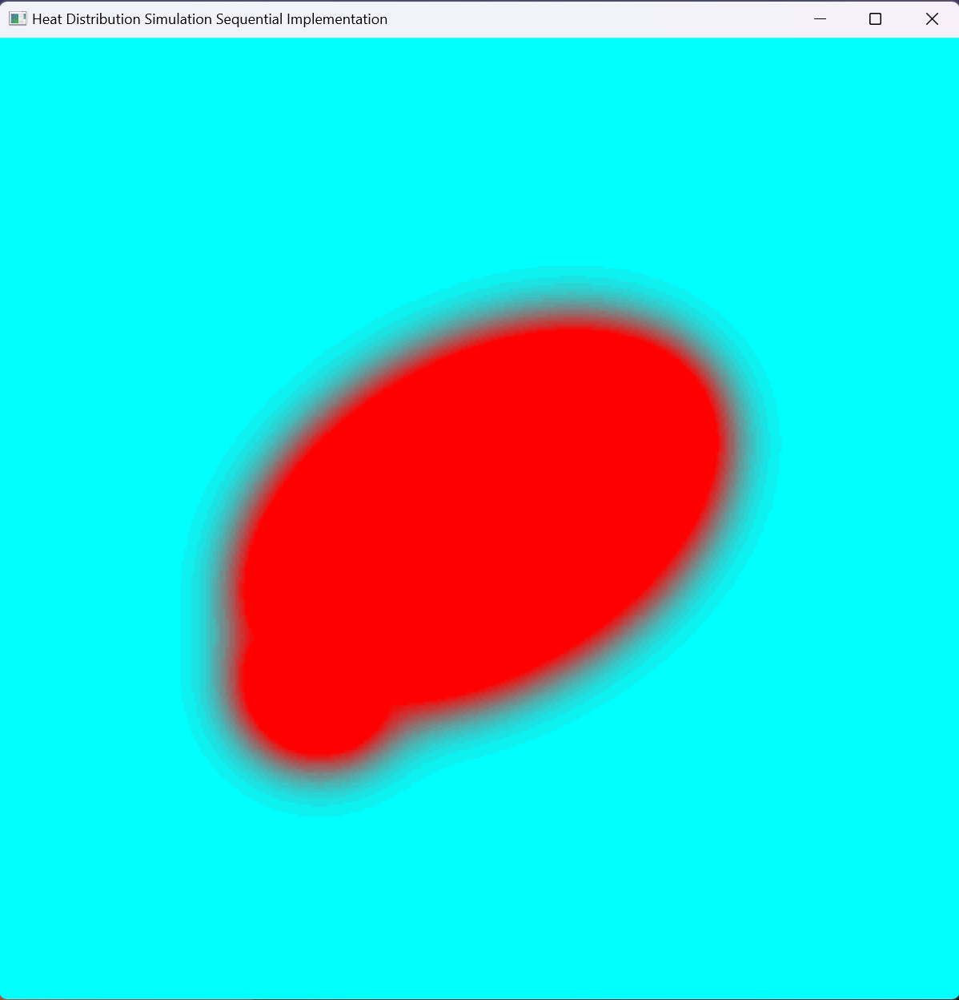
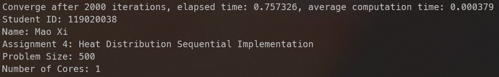
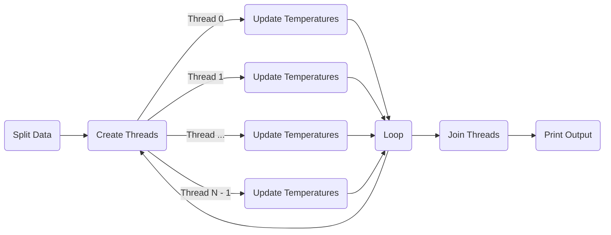
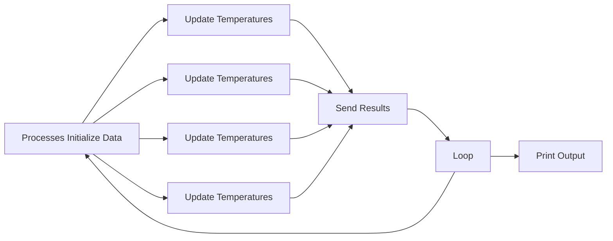

## Abstract

This project simulated the temperature change in a room with fire areas and walls using sequential, Pthreads, OpenMP, MPI, CUDA, and MPI-OpenMP approaches. Their performances were then compared and the results were discussed in this paper.

## Introduction

The room is surrounded by walls with temperature `WALL_TEMP`. The fire areas are spawned in fixed positions with specified temperature `FIRE_TEMP`. The room is split into multiple "pixels" with a grid specified by command line parameter `size`. In each iteration, the simulation keeps walls and fire areas' temperature constant and uses the Jacob iteration to update other pixel's temperature to the average of its four neighbors' temperatures: $Temp_i = avg(T_{up}+T_{down}T_{left}+T_{right})$. The process will be repeated for fixed rounds (specified by constant `MAX_ITERATIONS`).

The time complexity for one iteration is $O(N^2)$, because we are updating N * N pixels' temperatures. Since the number of iterations is fixed , the total time complexity is also $O(N^2)$.

The following are sample GUI and console outputs:





## Method and Design

### 0. Physics

The temperatures of pixels in the room are represented by a row-majored vector `std::vector<float> data`. `std::vector<bool> fire_area` is a bitmap indicating whether the pixel with corresponding index is fire. Initially, pixels in fire areas' temperature are set to `FIRE_TEMP`, and other pixels' temperatures are set to `WALL_TEMP`. Note: the function `maintain_fire` in the template is embedded into `update`.

```c++
void update(const int begin, const int end) {
    for (int i = begin; i < end; i++) {
        for (int j = 1; j < size - 1; j++) {
            const int idx = i * size + j;
            if (fire_area[idx]) new_data[idx] = FIRE_TEMP;
            else {
                const float up = data[idx - size];
                const float down = data[idx + size];
                const float left = data[idx - 1];
                const float right = data[idx + 1];
                const float new_val = (up + down + left + right) / 4;
                new_data[idx] = new_val;
            }
        }
    }
}

void maintain_wall(const int begin, const int end) {
    for (int i = begin; i < end; i++) {
        new_data[i] = WALL_TEMP;
        new_data[i * size] = WALL_TEMP;
        new_data[i * size + size - 1] = WALL_TEMP;
        new_data[len - size + i] = WALL_TEMP;
    }
}
```

### 1. Sequential Program

The sequential program becomes straightforward -- update temperature and maintain fire and walls' temperatures for `MAX_ITERATIONS` iterations. To avoid data race, new temperatures are write to a temporary vector `std::vector<float> new_data`. After an iteration finishes, `std::swap` is called to swap `data` and `new_data` to apply temperature changes.

```c++
while (count++ <= MAX_ITERATIONS) {
    // other staffs
    update(1, size - 1);
    maintain_wall(0, size);
    std::swap(data, new_data);
	// other staffs
}
```


### 2. General Parallel Design

N bodies are evenly split by rows into m subsets, where m is the number of workers (processes or threads). Each worker will be in charge of updating **a subset of rows of pixels**' temperatures. Additionally, a displacement array `displs` is created to record the begin and end index of each worker's subset, facilitating work distribution in each iteration.

```c++
// linearly and evenly split the data
void split_data(int* counts, int* displs, const int total_count,
                const int num_partitions) {
    const int quotient = total_count / num_partitions;
    const int remainder = total_count % num_partitions;
    for (size_t i = 0; i < num_partitions; i++) {
        counts[i] = quotient;
        if (i < remainder) counts[i]++;
    }
    displs[0] = 0;
    for (size_t i = 1; i <= num_partitions; i++) {
        displs[i] = displs[i - 1] + counts[i - 1];
    }
}
```

### 3. Pthreads Program

M (specified by command line arguments) threads are created to do simulation. Since `Pthreads` is a shared memory parallel model, all I need to do is to create N threads and split computation tasks to them.

```c++
std::vector<pthread_t> threads(n_thd);
for (int i = 0; i < n_thd; ++i) {
    pthread_create(&threads[i], nullptr, worker, &args[i]);
}
```

Each worker thread will simulate its subset of rows for n iterations (specified by arguments, too). Moreover, when a thread finishes one iteration, it reaches a barrier and cannot proceed until all threads finish an iteration. The synchronization mechanism ensures one Jacob iteration finishes in all threads before the next one begins in some threads.

```c++
void* worker(void* args) {
    auto [begin, end] = *static_cast<Args*>(args);
    // initialize fire area
    generate_fire_area(begin[1], end[1]);
    pthread_barrier_wait(&barrier);

    int count = 1;
    while (count++ <= MAX_ITERATIONS) {
        // update temperature
        update(begin[0], end[0]);
        pthread_barrier_wait(&worker_barrier);

        maintain_wall(begin[1], end[1]);
        pthread_barrier_wait(&barrier); // wait for one iteration to finish

        pthread_barrier_wait(&barrier); // wait until check_continue and std::swap finish
    }

    pthread_exit(nullptr);
    return nullptr;
}
```

Moreover, `pthread_barrier_wait()` is used to synchronize the main thread and worker threads' progress

```c++
pthread_barrier_wait(&barrier); // wait for initialization
while (count <= MAX_ITERATIONS) {
	// other staff
    pthread_barrier_wait(&barrier); // wait for one iteration to finish
    std::swap(data, new_data);
    pthread_barrier_wait(&barrier); // threads wait for swap to finish
    // other staff
```

In the end, main thread waits for worker threads to finish execution by calling `pthread_join`.



### 4. OpenMP Program

The OpenMP version is quite simple: Adding a `#pragma omp parallel for` directive will do the trick.

```c++
void update_omp() {
    // update_omp the temperature of each point, and store the result in `new_data` to avoid data racing
    #pragma omp parallel for
    for (int i = 1; i < size - 1; i++) {
        for (int j = 1; j < size - 1; j++) {
            // update a pixel's temperature
        }
    }
}

void maintain_wall_omp() {
    #pragma omp parallel for
    for (int i = 0; i < size; i++) {
        // update a pixel's temperature
    }
}
```

### 5. MPI Program

M (specified by command line arguments, 1 master and M - 1 slaves) processes are created to do calculations.

#### Data Distribution

Each process initializes and holds a full copy of `data`. 

#### Computation

Master and all slave processes will all do the computation. Each process computes its own subset of rows of data. Then, each process will send the first and last updated rows to its previous and next process, respectively, allowing them to update temperature correctly in next iteration.

```c++
void do_one_iteration() {
    update(displs[rank], displs[rank + 1]);
    
    // send the last row to next rank
    if (rank != world_size - 1) {
        float* last_neighbor_row = &new_data[displs[rank + 1] * size];
        float* last_row = last_neighbor_row - size;
        MPI_Send(last_row, size, MPI_FLOAT, rank + 1, 0, MPI_COMM_WORLD);
        MPI_Recv(last_neighbor_row, size, MPI_FLOAT, rank + 1, 0, MPI_COMM_WORLD, MPI_STATUS_IGNORE);
    }
    // send the previous row the previous rank
    if (rank != 0) {
        float* first_row = &new_data[displs[rank] * size];
        float* first_neighbor_row = first_row - size;
        MPI_Recv(first_neighbor_row, size, MPI_FLOAT, rank - 1, 0, MPI_COMM_WORLD, MPI_STATUS_IGNORE);
        MPI_Send(first_row, size, MPI_FLOAT, rank - 1, 0, MPI_COMM_WORLD);
    }
    
    maintain_wall(0, size);
    std::swap(data, new_data);
}
```

Similar to the Pthreads version, `MPI_Barrier()` is called after each iteration to synchronous processes.

#### Data Collection

Since each process holds a full copy of data, there's no need for data collection.



### 6. MPI + OpenMP

This version modifies the vanilla MPI program by using OpenMP to run function `update` and `maintain_wall` in each process.


### 7. CUDA Program

This version is different from previous ones. Since we have plenty of CUDA cores, I will launch as many CUDA threads as number of bodies, each will in charge of updating **one** body's data. 

```c++
__global__ void update_cuda(const float* device_data, float* device_new_data, 
                            const bool* device_fire_area, const int size, const int len) {
    const int idx = blockDim.x * blockIdx.x + threadIdx.x;
    if (idx - size < 0 || idx + size >= len) return; // to avoid invalid array access
	// update device_new_data[idx]
}

__global__ void maintain_wall_cuda(float* device_new_data, const int size, const int len) {
    const int t_idx = blockDim.x * blockIdx.x + threadIdx.x;
    if (t_idx >= size) return;
    // update device_new_data[idx]
}
```

After each iteration, the position vector is copied from device memory to host memory for GUI display purpose.


## Running and Experiments

### 1. Compile and Run

#### Compile the Project

The project uses the provided code template with CMake as the build tool. You can `cd` to project root directory and run the following shell scripts to build:

- `scripts/cmake_release.sh` for non-GUI version
- `scripts/cmake_release_gui.sh` for GUI version

Alternatively, you can enter commands contained in above scripts by your self:

Without GUI:

```shell
cd <project root path>
mkdir build-release-nogui
cmake -DCMAKE_BUILD_TYPE=Release -G "Unix Makefiles" -S . -B ./build-release-nogui
cmake --build ./build-release-nogui
```

With GUI:

```shell
cd <project root path>
mkdir build-release-gui
cmake -DCMAKE_BUILD_TYPE=Release -DGUI=ON -G "Unix Makefiles" -S . -B ./build-release-gui
cmake --build ./build-release-gui
```

#### Run the Executables

The compilation process will generate six executables: `sequential`, `pthread`, `openmp`, `mpi`, `cuda`, `mpiomp`

Assume you already `cd` into the build directory. The ways to run them are the same as those in code template:

- Sequential: 

  ```shell
  ./sequential $size
  ```

- Pthreads

  ```shell
  ./pthread $size $num_thread
  ```

- OpenMP

  ```shell
  ./openmp $size $num_thread
  ```

- MPI

  ```shell
  mpirun -np $n_proc ./mpi $size
  ```

- CUDA

  ```shell
  ./cuda $size
  ```

- MPI-OpenMP

  ```shell
  mpirun -np $n_proc ./mpiomp $size $num_omp_thread
  ```


### 2. Experiments Design

In experiments, all graphs were square (800 x 800). Term `data size` would be used to reference the size parameter. I selected the following data size to do experiments:

- 1000 (small), 2000 (medium), 4000 (large)

For the CUDA program, additional massive sized data (data size = 8000, 16000) were used. 

Moreover, for Pthreads, OpenMP, and MPI programs, the following number of threads/processes were used to test the effect of parallelism:

- 1, 2, 4, 8, 16, 32, 40

For the MPI-OpenMP program, OpenMP always used 4 threads, and MPI used the following number of processes:

- 1, 2, 4, 8, 10

Experiments were done without GUI (i.e. computation only) in the HPC. Each case will be run for **5 times** to get the average running time and speed.

I wrote python scripts `run_tests_<type>.py` to enumerate all combinations of data size and thread/process number, generate a `sbatch` script for each configuration, and submit the tasks to the HPC. I also wrote a python script `parse_outputs.py` to collect the running time of each task and put the statistics into a csv file.

## Result and Discussion

### 1. Sequential

Figures below displayed the running time and speed of the sequential program:


The running time suggested that the experiment data roughly followed $O(N^2)$ time complexity, which fit the theoretical complexity well.

### 2. Pthreads

Figures below demonstrated the running time of different test cases.


The performance of the 1-thread Pthreads program was close to that of the sequential one.

When the number of threads is small, for a fixed number of threads, the growth trend of running time still roughly fit the time complexity discussed before. This is not true for larger numbers of threads, because the overhead of parallelism exceeds its benefit, so that the running time for size=1000 and 2000 cases would be larger than expected. When thread number is small, starting from two threads, doubling number of threads roughly cut half of running time, which is under expectation. However, going from 1 thread to 2 threads didn't bring much speed up. This was due to the additional overhead induced by mutex lock and synchronization between threads.  

The following figures displayed the speed up factors of each configuration:


Generally, for fixed number of threads, as data size increased, the speed-up factor first increased until reaching a stable point. However, the 32 threads and 40 threads versions are two anomalies, which had low speed-up factor for size=1000 and 2000. This is also due to the excess overhead of high parallelism as explained above.

### 3. OpenMP

Figures below displayed the running time of various OpenMP configurations:


The OpenMP version was faster than the Pthreads one. Also, its speed-up factor demonstrated different properties:


In nearly all configures, OpenMP overperformed Pthreads in speed-up factor. Moreover, the speed-up curve went down from size=2000 to size=4000 for configurations with more than 16 threads, especially for the 40 threads version. The second finding suggested that these three configurations of OpenMP suffered from high overhead as as the Pthreads version did. And the first finding suggested that the OpenMP program was a slightly better choice for this task, possibly because it didn't have the overhead of synchronization (`pthread_barrier_wait`).

### 4. MPI

Figures below were the results of running the MPI program:


Regarding running speed, MPI performed worse than OpenMP but better than Pthreads, so was MPI's speed-up factors, which could be better viewed in the speed up chart presented below: 


The chart indicated an interest fact: Compared to OpenMP, MPI's speed-up factors were slightly lower for size=1000 and 2000. And the two versions had roughly the same speed-up factors for size=4000. However, opposite the OpenMP, the 32 and 40 processes curves increased when size grew up, which demonstrated MPI potential of handling large level of parallelism. It was reasonable to predict that MPI would perform better for larger numbers of processes (such as 64 processes) on size=4000. 

### 5. MPI-OpenMP

Below were running time charts of the MPI-OpenMP program. MPI's chart was also attached for reference:


<center>
    
</center>


The comparison between MPI and MPI-OpenMP programs indicated that, by using 4-threads OpenMP, the MPI-OpenMP program achieved 2~4x speed-up, which was pretty decent, since pure OpenMP only had less than 50%  system efficiency. Another interesting fact was MPI-OpenMP's chart looked very "standard" -- There were no fluctuations; Running time quadrupled when data size doubled, and went to a half when number of processes doubled (until suffering from large parallelism overhead when the number of processes was too large).


Regarding speed-up factors and system efficiency, surprisingly, MPI-OpenMP performed better than both MPI and OpenMP. One possible explanation was that this approach combined the advantages of MPI and OpenMP:

1. Compared to pure MPI, MPI-OpenMP had fewer processes, thus reduced message passing overheads
2. Compared to pure OpenMP, MPI-OpenMP had less threads waiting for entering the critical section, increasing multi-threading efficiency


### 7. CUDA

Below was the running time chart of the CUDA program:


CUDA was analyzed separately because in this program, the number of CUDA threads matched the number of bodies, so that it was pointless to study the relationship between running time and number of threads. However, it was worthwhile to point out that CUDA's performance significantly crushed that of all previous versions, which was quite impressive. The running speed, defined as $\text{size}^2$ / running time, was displayed below:


As shown in the chart, the running speed first increased at first and then remained stable roughly at size=8000. The running speed was low at first because the overhead (e.g., time to copy data between device memory and host memory) shadowed the benefit of parallel computing. As data size increased, the stable running speed reflected the computing speed of a CUDA core.

## Conclusion

In this project, I implemented sequential, Pthreads, OpenMP, MPI, MPI-OpenMP, and CUDA versions of Heat simulation and done experiments to investigate their performance under several problem / hardware configurations. The results showcased the surprising performance of MPI-OpenMP, demonstrating the potential benefit of combining multiple parallel programming models. Moreover, the computation task was simple but was massive in size, which matched GPU's hardware design. Indeed, the results of the CUDA program demonstrated unparalleled advantage in running speed. Therefore, CUDA should be first considered in such situations.

